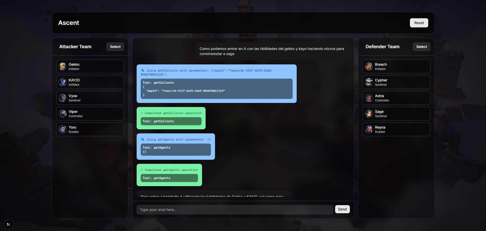
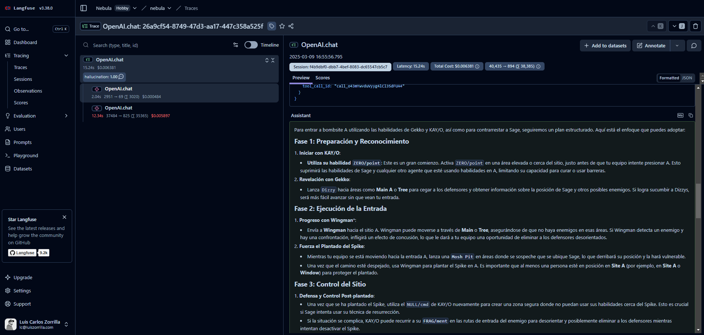

# Nebula App

### Contexto
Valorant es un videojuego multijugador 5v5 basado en estrategia, disparos y habilidades, para PC y consolas.
El juego es simple, el equipo atacante tiene que entrar a un site y plantar la spike (bomba), mientras que el equipo defensor debe evitar que esto pase, o si pasa, detonar la spike antes de que explote.
Existe una regla que hace que todo avance, si un jugador muere, no reaparecera hasta la proxima ronda.
El primer equipo en llegar a 13 rondas, gana la partida.

Con un repertorio de 22 agentes, 10 armas distintas y 18 mapas, las posibilidades de como plantear la estrategia son casi infinitas.

Cada agentes tiene un rol:
- Duelista: Encargado de entrar al site y eliminar la mayor cantidad de enemigos que pueda.
- Iniciador: Rol de support para el equipo, obtiene informacion, neutraliza o minimiza al rival.
- Controlador: Humos, control de zonas.
- Centinela: Rol defensivo cuyas habilidades se centran en trampas, camaras. Bloquea lurkers (enemigos que vienen por la espalda)

Debido a los roles y que cada agente tiene 4 habilidades y una ultimate, la composicion de agentes que un equipo decide antes de iniciar la partida es clave, teniendo el cuenta el mapa y las sinergias entre habilidades de los agentes, asi como contrarestar las habilidades enemigas.

La macro estrategia consiste en tomar decisiones conceptuales a nivel superior: 
- Direccion: A que site vamos esta ronda
- Economia: Compramos armas fuertes o debiles para ahorrar para la siguiente ronda
- Fakes: Hacemos ruido en A para ir B y tomar desprevenido al equipo
- Etc...

La micro estrategia es la tactica en circunstancias definidas, sinergias de habilidades:
- Tira un humo, entro a el, tiro una flash y salimos todos...
- Stun de una zona y el duelista dashea para matarlos stunneados...
- Etc...

Con esto dicho, en los partidos competitivos (en donde los premios y las views rozan millones) los equipos profesionales estudian la macro y micro de los equipos rivales dias antes del enfrentamiento.

Y es ahi donde entra Nebula...

### Descripción
Nebula es una app desarrollada con Next.js que integra la API de Valorant para crear estrategias por medio de un AI assistant. El objetivo principal es poder crear micro y macro estrategias en distintas circusntancias, teniendo en cuenta la composicion de agentes de ambos equipos (con sus habilidades) y el mapa (con sus callouts).

El unico feature es un agente conversacional que puede realizar distintas consultas:
- getAgents: Retrieve de todos los agentes (no es realmente relevante, pero es solamente con demo purposes, debido a que esta info ya la tiene del user)
- getMaps [not active]: Retrieve de todos los mapas (tampoco es relevante, decididi quitarla por tokens, demo purposes)
- suggestPlacement [params: mapName, agentsNames, side]: Define la colocacion inicial al inicio de la ronda de el bando seleccionado
- getCallouts [params: mapId]: Obtiene los nombres de las zonas del mapa con su respectivo site (A, B, C)
- finishTask: Break agent loop



El agente usa el modelo 4o-mini de OpenAI con un observer de Langfuse para el tracking de los traces y pricing.
El unico eval configurado son Hallucinations, de tampoco tiene una configuracion tan extensa, simplemente el template de Langfuse con 2-3 tweaks para Valorant.



### Libraries
- **Next.js (App Router)**: Maneja la estructura y las API Routes.
- **TanStack Query**: Se utilizan hooks (useQuery) para obtener datos de la API.
- **Redux Toolkit**: Gestiona el estado global.
- **shadcn UI**: Componentes visuales.
- **API Valorant**: Se consume a través de una API Route.
- **Langfuse**: Evals and logging
- [Pendiente] DeepEval (non-js)

### Que mejoraria si tuviera mas tiempo
- Tools se muestran al momento de ser utilizadas por el agente (por desconocimiento del server component no lo hice)
- Mucho mejor contexto y con mas sentido
- Output de mapas 2d con coordenadas de ejecucion
- Optimizar el rendimiento de carga de imágenes
- Implementar pruebas unitarias y de integración
- Completar documentación de componentes y comments

### Resources and Libraries
- **Next.js (App Router)**
    - https://nextjs.org/docs/pages/building-your-application/routing/api-routes
    - https://nextjs.org/docs/pages/building-your-application/rendering/server-side-rendering
    - https://nextjs.org/docs/pages/building-your-application/rendering/client-side-rendering
    - https://nextjs.org/docs/pages/building-your-application/data-fetching/client-side
    - https://nextjs.org/docs/pages/api-reference/functions/next-response
- **TanStack Query**
    - https://www.youtube.com/watch?v=mPaCnwpFvZY
- **Redux Toolkit**
    - https://www.youtube.com/watch?v=QgK_-G-hWeA
    - https://zustand.docs.pmnd.rs/getting-started/introduction
- **shadcn UI**
    - https://ui.shadcn.com/docs/installation/next
- **API Valorant**
    - https://dash.valorant-api.com/endpoints/agents
- **Langfuse**
    - https://us.cloud.langfuse.com/project/cm8154yf2001pad072l3c32yt
    - https://www.youtube.com/watch?v=2E8iTvGo9Hs
- **Vitest**
    - https://vitest.dev/api/
    - https://vitest.dev/api/mock.html
    - https://www.youtube.com/watch?v=CxSL0knFxAs

### Instalación

Para instalar y ejecutar Nebula en tu entorno local, sigue estos pasos:

1. **Clona el repositorio**
   ```bash
   git clone https://github.com/czorr/nebula.git
   cd nebula
   ```

2. **Instala las dependencias**
   ```bash
   npm install
   # o
   yarn install
   # o
   pnpm install
   ```

3. **Configura las variables de entorno**
   Crea un archivo `.env.local` en la raíz del proyecto con las siguientes variables:
   ```
    OPENAI_API_KEY=sk...

    MAX_ITERATIONS=10

    LANGFUSE_SECRET_KEY=sk...
    LANGFUSE_PUBLIC_KEY=pk...
    LANGFUSE_BASEURL=https://us.cloud.langfuse.com
   ```

4. **Ejecuta la aplicación en modo desarrollo**
   ```bash
   npm run dev
   # o
   yarn dev
   # o
   pnpm dev
   ```

5. **Accede a la aplicación**
   Abre tu navegador y visita `http://localhost:3000`

### Comandos adicionales

```bash
# Construir la aplicación para producción
npm run build

# Ejecutar la aplicación en producción
npm start

# Ejecutar linter
npm run lint
```

### Requisitos
- Node.js 18.x o superior
- npm, yarn o pnpm

